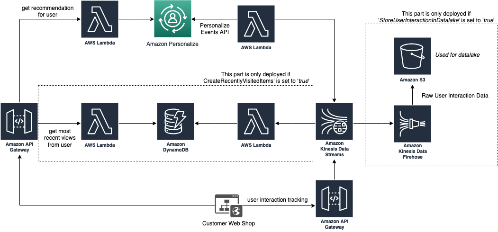

# Amazon Personalize Ingestion Solution

This sample code sets up a pipeline for real time data ingestion into Amazon Personalize to allow serving personalized recommendations to your users. The pipeline takes in user interaction data (e.g., visited items to a web shop or purchases in a shop) and automatically updates the recommendations in Amazon Personalize. The interaction tracking as well as serving the recommendation is done via REST APIs.
Additionally, the ingested data is used for providing a history per user that can be queried via a REST API, and storage of the raw interaction data in Amazon S3.

The sample should serve as a starting point to integrate Amazon Personalize smoothly into your project and can be adjusted to exactly serve your requirements (e.g., by adjusting how the data is ingested if interactions are tracked on your servers instead of the user's browser).

## Deployment

To deploy this sample, you first need to configure a [Personalize model](https://docs.aws.amazon.com/personalize/latest/dg/getting-started.html). After you have created this, update the required parameters in the [parameters.cfg](parameters.cfg) file before running `make` to deploy this template into your AWS console.

Available parameters to change what is deployed are

| Parameter Name                 | Description                                                                                                                                       | Required             |
|--------------------------------|---------------------------------------------------------------------------------------------------------------------------------------------------|----------------------|
| CustomerInteractionShardCount  | Number of [Kinesis Shards](https://docs.aws.amazon.com/streams/latest/dev/key-concepts.html#shard) to handle incoming customer interactions.      | Yes (default 1)      |
| TrackingId                     | ID of the Amazon Personalize Events API that should be updated                                                                                    | Yes                  |
| CampaignArn                    | ARN of the Amazon Personalize campaign that should be used for giving recommendations                                                             | Yes                  |
| CreateRecentlyVisitedItems     | Set to `true` if the parts of the application should be deployed that track recently visited items for each user and offers them as an API        | Yes (default `true`) |
| StoreUserInteractionInDatalake | Set to `true` if the parts of the application should be deployed that store data from user interactions in S3 for working with them in a datalake | Yes (default `true`) |
| ViewedItemHistoryDays          | Number of days items are kept in history if `CreateRecentlyVisitedItems` is `true`                                                                | Yes (default `30`)   |

## Components of this solution

*High level architecture overview of Personalize Ingestion setup*

## Next steps

By adding custom code to the Lambda function that serves the recommendation (see folder [lambda-recommendation-api](lambda-recommendation-api/)) you can change the serves recommendations to include more details on the recommended articles (e.g., article name, description or the URL to a preview image) to save roundtrip times for the customer.

The accuracy of the Amazon Personalize model can be increased by adding [additional metadata](https://docs.aws.amazon.com/personalize/latest/dg/how-it-works-dataset-schema.html) (e.g., about users or the product catalogue) to the model. While this is not covered by this sample, you could use the [sample for automated retraining](https://github.com/aws-samples/amazon-personalize-automated-retraining) to automatically retrain the model upon changes in your dataset or a schedule.

You can also increase the accuracy of the prediction by using multiple Amazon Personalize models (e.g., a special one for new users to improve the accuracy on these "cold starts"). Again, you would extend the code of the Lambda function that serves the recommendation (see folder [lambda-recommendation-api](lambda-recommendation-api/)).

## License

This library is licensed under the MIT-0 License. See the LICENSE file.

